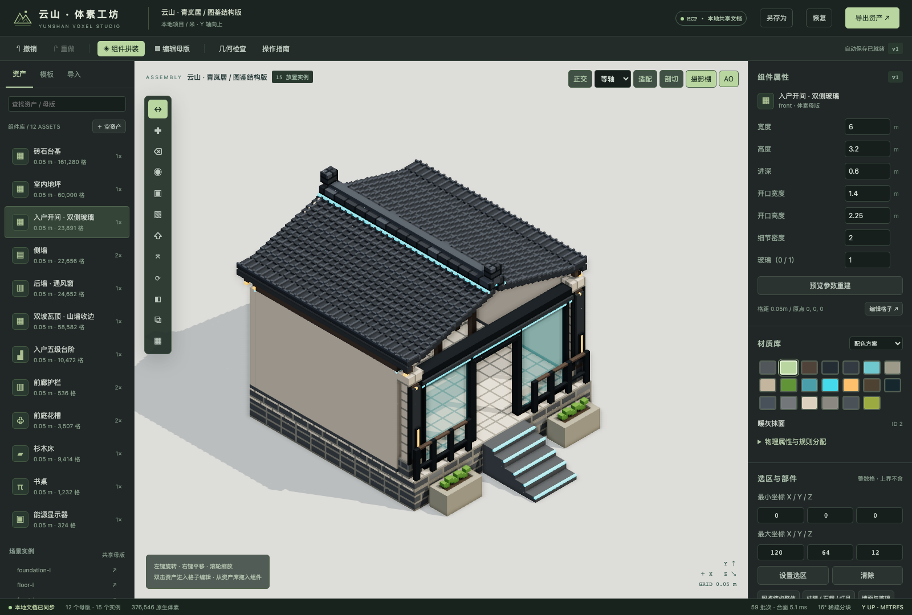

# 云山 · 体素工坊

可实际编辑和保存的本地三维资产编辑器。基础块件使用体素；连续坡面保存独立网格，天空与星空使用贴图。原生文件分别保存这些层的权威数据与用途材质 ID。界面和 stdio MCP 通过同一个后台文档服务编辑，没有第二份 AI 文档。

本项目位于独立的 `voxel-studio/` 目录，未改动上级项目文件。

67 张完整图册已接入「图册」页，793 条参考逐 ID 对齐。M001–M037 的 **444 个基础 ID**已制作为候选，其余 349 条待制作或复核，人工美术验收为 0。[模型与历史记录](docs/ATLAS-PRODUCTION.md) · [M037 年龄衣装与职业制服说明](docs/M037-CHARACTER-COMPONENTS.md) · [最新总览](artifacts/atlas/atlas-20261004130221/M037.png)。合并旧库后有 463 个基础候选；实例与参数形态不增加基础资产数。

材质按用途与物理类别分配独立 ID，后期统一更换外观。新配方禁止按颜色借用类别；外观包不能改变类别或碰撞设置。[分类约定与当前复核范围](docs/MATERIAL-ROLES.md) · [显微镜真实前后对照](artifacts/microscope-study/comparison.png)。

三张参考图的 **40 件现有设计**已附加可切换的 PBR 材质试作，保留原始体素和素色方案：[材质结果、差距与测试](docs/MATERIAL-STUDY.md) · [同光照前后对照](artifacts/material-study/pilot.png)。批量库中选择「材质」组可直接打开；此批没有增加基础模型完成数，尚未达到参考图整体美术标准。

建筑两张参考图已建立 28 项原生体素候选（A01–A12、B01–B16），包含开间、屋顶、连廊、门窗、栏杆、灯具、花槽与铺地。默认 2cm 格距、纯色验形；[结构、文件与验证说明](docs/ARCHITECTURE-REFERENCES.md) · [建筑主体实拍](artifacts/architecture/sheet-A.png) · [立面细部实拍](artifacts/architecture/sheet-B.png)。打开「批量库 → 参考图鉴」可切换总览和单件，原有家居库及早期图鉴保留。

新增窗前细部工作台：开间、栏杆、回纹花槽和灯笼四个独立体素母版。编辑器「素色」按钮可保留基础色、关闭纹理与视觉效果，检查实际几何；[实际素色预览](artifacts/flat/overview.png) · [细部构造、原生文件和验证范围](docs/DETAIL-STUDY.md)。

早期制作记录：[四构件几何与材质精修](docs/FOUR-COMPONENTS.md) · [纯色总览](artifacts/polish/flat-overview.png) · [材质总览](artifacts/polish/material-overview.png)。更新原有四个 `study-*` 母版，资产总数保持不变。新增 30 个精修材质角色、纹理种子/旋转、明确的「纯色 / 材质」模式及选区聚焦。实测 stdio MCP 整批撤销、浏览器同步、保存与四件 GLB 重导入；详细结果和限制见文档。

清单工作流：[城市清单与细节制作](docs/PRODUCTION-CATALOG.md)。已导入用户清单 1,068 条，区分 552 个基础组件、组合/变体/材质/动画；来源状态不等于美术验收。新增按需构建、选区隔离、窄面板适配、清单与母版关联，以及共享 MCP 查询和事务。默认纯色，优先几何细节。完整原生项目为 `projects/city-production.ysvox.json`；当前没有骨骼/关键帧动画编辑能力。

历史版本：[同格距几何研究](docs/GEOMETRY-STUDY.md) · [上一轮修改前后](artifacts/geometry-study/comparison.png)。

## 启动

环境：Node.js 24（本机已安装），npm。无需外部建模平台或云端密钥。

```sh
cd voxel-studio-yunshan # 或本机原有的 voxel-studio 目录
npm ci
npm run build
npx playwright install chromium  # 仅自动浏览器测试和 MCP 多视角截图需要
npm start
```

打开 **http://127.0.0.1:4317**。首次启动加载青岚居民居；以后优先恢复 `projects/autosave.ysvox.json`，损坏时尝试 `recovery.ysvox.json`。

已安装依赖时直接 `npm start`。修改前端源码后重新 `npm run build`；没有 `dist/` 时服务器使用 Vite 中间件。`VOXEL_PORT` 可更换端口，`VOXEL_PROJECT_DIR` 可指定独立项目根目录。每个目录只允许一个编辑服务进程。

## Codex 云端接续

仓库包含独立可运行的源码、当前库索引指向的原生项目、全部 67 张参考图、原始三张组件图、Tripo 测试原件及当前批次的验证证据。`cloud/manifest.json` 记录迁移文件的 SHA-256，`cloud/local-history.json` 列出留在原机的重复历史文件；这不是整块硬盘的备份。`projects/cloud-resume.ysvox.json` 保存迁移时的活动文档与撤销历史。历史截图和性能数据保留其原始测试环境，不能当作云端测试结果。

安装环境采用 Node.js 24、npm、Python 3；CPU 可以运行建模、MCP、检查和导出。安装与启动命令：

```sh
npm run cloud:setup -- --browser # 安装依赖、构建、校验，并安装 Chromium；不需要截图可省略 --browser
npm run test:cloud              # 两个测试进程，降低大资产测试的内存峰值
npm run cloud:start             # 首次恢复迁移文档；已有自动保存不会被覆盖
```

在 [Codex 云端环境设置](https://learn.chatgpt.com/docs/environments/cloud-environments) 中选择此仓库，安装后实际运行检查，再发布环境。新环境不会自动继承原聊天记忆，接续状态见 `cloud-handoff.txt` 和 `AGENTS.md`。无需 GPU 才能建模；浏览器截图可能使用软件渲染，Linux 不使用 `--metal`。编辑器和 MCP 保持回环地址访问，尚未发布为公开多人在线编辑服务。首次接收时用 `npm run cloud:check` 核对原始迁移快照；之后主动修改文件出现哈希差异是正常的，需要按新提交验证。

## 使用

- **拼装**：选择资产，拖入视口或在「安装与实例」中输入吸附坐标。实例引用母版；同接口替换会校验格距、端口位置、法线和截面。可保存/复用整个场景作为组合模板。
- **编辑**：双击母版或点「编辑母版」。工具栏有单格笔刷、擦除、取色、两点框选、填充、挤出、移动、90° 旋转、镜像、复制与阵列。笔刷拖动合并为一个撤销事务。
- **选区**：右侧输入整数格半开范围 `[min,max)`；也可选部件区域。X/Y/Z 对称平面按选区中心取整。空资产可在 Y=0 平面添加格子。
- **观察**：默认纯色，支持选区隔离/恢复、选区聚焦与侧栏收起；透视/正交/等轴、前后左右顶底、滚轮缩放、右键平移、剖切；摄影棚光照及可选 AO 接触阴影。单层 Y 观察在母版模式重建截面。
- **参数**：尺寸以米输入。基础块件按其格距生成；连续网格与天空参数保留各自精度。重建覆盖该母版的手工体素修改；预览会明确列出受影响实例。
- **材质**：14 个基础材质，图鉴样例含 20 个材质，包含题目要求的 10 类。修改真实 PBR 基础色、粗糙度、金属度、透明度与发光。支持区域、部件、方向、原材质、高度、外表面和棋盘规则；配色方案保存在项目内。
- **结构**：右侧底部的元数据编辑器可修改原点、部件父级、开口和安装端口。所有写入经过统一校验，支持撤销。
- **保护**：超过 4,096 个格或 10 个受影响实例的修改，必须提交同一版本生成的预览令牌。预览显示数量、包围盒与实例；取消不修改文档。
- **撤销**：Cmd/Ctrl+Z；Cmd/Ctrl+Shift+Z 重做。保留最多 50 步或约 64MB 历史字符串，至少保留最近一步；自动保存包含撤销/重做历史。
- **保存**：另存为保存原生项目；恢复前保存 `before-load.ysvox.json`，恢复操作本身可撤销。
- **导入**：选择 GLB / glTF / OBJ；glTF 的 BIN、图片及 OBJ 的 MTL 可同时选择。显式选择源单位倍数、Y/Z 向上、格距、网格原点、表面/实体与颜色策略及每通道 4/8/16 级量化。先检查预算，再启动可取消后台任务；转换结果需再次确认才写入项目。

## MCP

先启动编辑器。使用 [本机可直接使用的配置](docs/mcp.local.json)，或编辑 [可迁移配置](docs/mcp.example.json)。配置使用直接 Node/tsx 启动，避免 npm 横幅污染 stdio 协议。

```json
{
  "mcpServers": {
    "yunshan-voxel": {
      "command": "node",
      "args": [
        "/absolute/path/voxel-studio/node_modules/tsx/dist/cli.mjs",
        "/absolute/path/voxel-studio/src/server/mcp.ts"
      ],
      "env": { "VOXEL_URL": "http://127.0.0.1:4317" }
    }
  }
}
```

[完整工具 Schema](docs/tool-schemas.json) · [模板有效参数](docs/template-parameters.json) · [事务示例与协议说明](docs/MCP.md)。18 个 MCP 工具包含全部编辑命令、查询、检查、保存、导出、导入任务控制、清单、参考图册和真实多视角截图。通过官方 SDK 客户端进行过实际 stdio 握手、工具发现和调用验证。

## 你的参考图与 Tripo 模型

已用提供的真实 GLB 和参考图做对照。[实验报告与实际截图](docs/REFERENCE-STUDY.md)记录转换质量、耗时、失败记录和局限。

- `projects/courtyard-reference.ysvox.json`：12 个按图编写的参数体素母版，2.5cm 格距，可修改开口、尺寸与材质。
- `projects/courtyard-house.ysvox.json`：采用新结构与材质的可进入民居，12 个母版 / 15 个实例 / 1 个组合模板，含床、桌、显示器。
- `projects/reference-study/tripo-original.glb` / `reference.png`：原件完整副本。
- `projects/reference-study/tripo-converted.ysvox.json`：两档表面转换与人工材质规则实验。
- `projects/reference-study/exports/`：图鉴与两档转换的 GLB、原生体素、碰撞及接口。
- `npx tsx scripts/reference-study.ts`：4337 端口、独立目录、真实 MCP 与浏览器重新验证。

本次由 AI 分析图中结构并编写参数模板，再调用 MCP 生成；不是通用图像自动生成三维，也不声称能推断不可见背面。

## 样例与结果

- `projects/qinglan-house.ysvox.json`：15 个独立母版、16 个放置实例、1 个组合模板、2 个配色方案。墙段、窗、大门、楼梯、屋顶、栏杆、花槽、床、桌和显示器均为原生体素。
- `projects/verified-house.ysvox.json`：通过实际 MCP 保存的项目。
- `projects/exports/verified-house/`：视觉 GLB、无损体素 JSON、碰撞格、接口和材质图集。
- `projects/fixtures/bonded-thin-holes.obj`：本地生成的可复现缺陷网格，不冒称生产模型。
- `projects/fixtures/result-0.1.json` / `result-0.05.json`：两档精度结果和诊断。
- `projects/fixtures/solid-failure.json`：实际拒绝填充的失败记录。
- `artifacts/editor-exterior.png`、`editor-cutaway.png`：实际编辑器截图。
- `artifacts/mcp-batch-applied.png`、`mcp-batch-undone.png`：真实 MCP 修改与一次撤销后的截图。
- `artifacts/import-compare-0.1.png`、`import-compare-0.05.png`：真实原件/转换对照。
- `artifacts/multiview/`：MCP 生成的七个视角 PNG。



## 验证

```sh
npm test          # 无界面核心、参数模板、几何、导入、导出测试
npm run verify   # 独立目录 / 4327 端口，真实浏览器 + stdio MCP + 重启恢复
```

详细计时、环境、原始采样、通过项和限制见 [实测报告](docs/VALIDATION.md)、[原始验证 JSON](artifacts/verification.json) 和 [功能边界表](docs/CAPABILITIES.md)。性能来自实际执行，未填入目标帧率。`verify` 会生成新的隔离测试目录，不改动正在编辑的项目。

## 实现分层

| 目录 | 职责 |
| --- | --- |
| `src/core` | 16³ 稀疏网格、材质、模板、事务、几何检查、贪心合面、Schema |
| `src/server/document-worker.ts` | 单一权威文档、后台命令执行、撤销、持久化、导出 |
| `src/server/main.ts` | 回环 HTTP/WebSocket、同源检查、任务调度、文件目录限制 |
| `src/server/mcp.ts` | 官方 SDK stdio 适配，同一 API/Schema |
| `src/client` | 可视化交互、分块 Web Worker 合面、Three.js 显示 |
| `src/import` | GLB/glTF/OBJ 读取、诊断、后台体素化 |
| `src/export` | GLB、图集、碰撞与接口导出 |
| `tests` / `scripts` | 核心测试、可复现缺陷源、浏览器/MCP 验证 |

数据格式及引擎读取方式见 [FORMAT.md](docs/FORMAT.md)。依赖锁定在 `package-lock.json`。

## 已知边界

这是可运行的本地编辑器首版；不是成熟 DCC 的全功能替代品。透明度使用排序混合，没有真实折射或 GI；碰撞与支撑检查不是物理仿真。OBJ 只支持顶点色/MTL Kd，不采样 `map_Kd`；带贴图请用 GLB/glTF。蒙皮、Morph、Draco/meshopt 压缩需先在源端烘焙/解压，遇到不支持的输入会失败并保留原件。

配色方案当前作用于共享材质库；尚无同一场景中逐实例的材质覆盖。框选是三维两角点/数值区域，不是任意屏幕套索。端口只支持轴向法线与 90° 旋转；不同格距可共存，自动接口连接要求格距一致。孔洞语义、拓扑修复和自交精确修复不自动推断。完整逐项说明见功能边界表。
