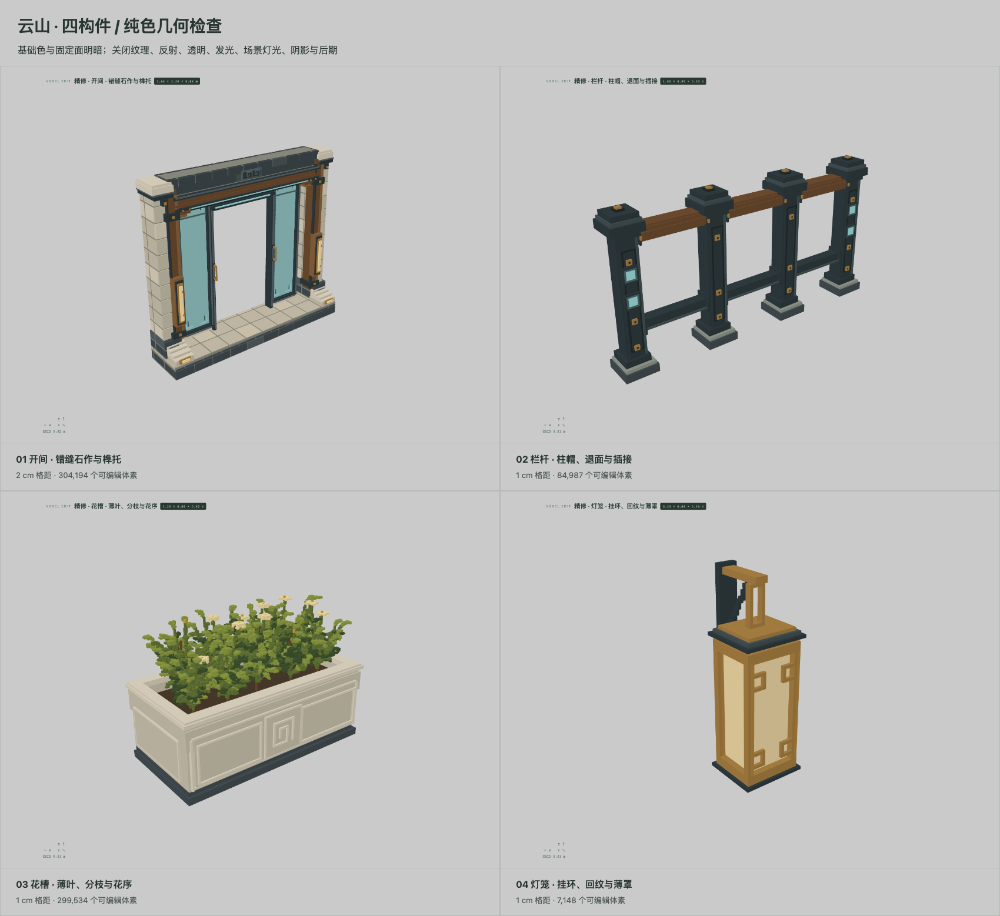
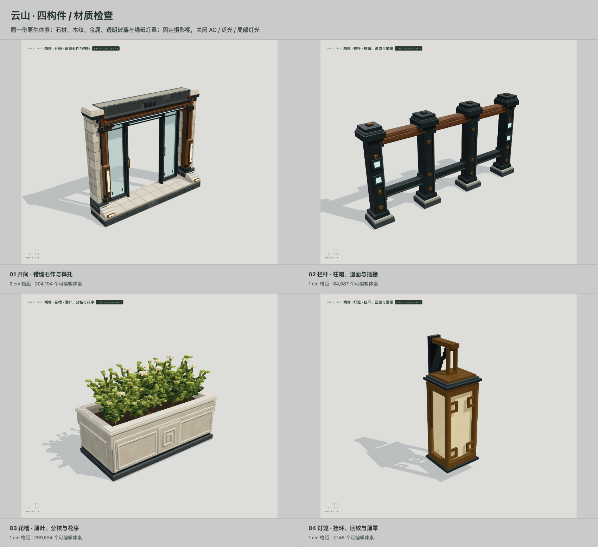

# 四构件精修：原生几何与材质分开检查

本轮更新已有 `study-bay`、`study-railing`、`study-planter`、`study-lantern` 四个母版，没有新增资产数量。主项目仍为 20 个历史母版、15 个放置实例。此处交付不代表千件资产库或整栋民居美术已经完成。

## 直接查看

- [开间](http://127.0.0.1:4317/?asset=study-bay&view=perspective&flat=1)
- [栏杆](http://127.0.0.1:4317/?asset=study-railing&view=perspective&flat=1)
- [花槽](http://127.0.0.1:4317/?asset=study-planter&view=perspective&flat=1)
- [灯笼](http://127.0.0.1:4317/?asset=study-lantern&view=perspective&flat=1)

顶部「纯色」「材质」切换同一份模型。右侧选择部件或填写选区后，「聚焦」放大该区域。纯色保留基础色和固定面朝向明暗；关闭贴图、透明、反射、发光、场景光照、阴影、AO 和后期。材质截图使用现有固定摄影棚，关闭 AO、辉光和近似局部灯光。





## 实际改动

| 母版 | 几何 | 材质 |
|---|---|---|
| 开间 | 错缝砌石、分层柱帽、四级侧座、梁下榫托、灯匣、门把手安装片；中央通道完全留空 | 横梁与立柱分别使用横纹/竖纹榆木；砂岩、深灰檐砖、烤漆铁、黄铜、青灰透明玻璃 |
| 栏杆 | 1cm 格距；柱面凹进、柱鞋、分层柱帽、木扶手截面、插接套座、带凹心的铆钉 | 木纹沿扶手长度；铁件表面与切边分开，铜铆钉与灯条单独赋材质 |
| 花槽 | 1cm 格距；退进面板、中心回纹、侧背面收边、口沿截面；曲线分枝、渐尖薄叶、独立花序与土层 | 三层叶色、米黄花瓣、花蕊、土壤；石面低频斑驳与细颗粒 |
| 灯笼 | 1cm 格距；墙座、斜撑、镂空挂环、顶盖通气退槽、角柱与回纹、内退薄灯罩、空腔及底坠 | 绢纸灯罩、黄铜框架、铁制顶沿、独立暖白灯芯 |

这些构造全部是体素及材质 ID，没有额外挂载装饰网格。新增 `atelier-finish` 风格含 30 个可复用材质角色，ID 201–230；旧材质库与其他母版、实例保持原值。程序纹理不会修改占据格子。

## 数据与实测

| 母版 | 格距 | 占据体素 | 实际包围尺寸（米） | 生成 / CPU 合面（毫秒） |
|---|---:|---:|---|---:|
| 开间 | 0.02m | 304,194 | 3.64 × 3.20 × 0.86 | 见本次 verification.json |
| 栏杆 | 0.01m | 84,987 | 1.80 × 0.95 × 0.20 | 同上 |
| 花槽 | 0.01m | 299,534 | 1.20 × 0.84 × 0.62 | 同上 |
| 灯笼 | 0.01m | 7,148 | 0.20 × 0.64 × 0.24 | 同上 |

尺寸含收边凸出；灯笼原点用于安装定位，实际最低占据格位于原点上方 0.06m。植物高度参数是生成空间，实际枝叶包围盒另行计算。两种预览模式共享同一资产 SHA-256。

[原始实测与导出核验](../artifacts/polish/verification.json)记录每次生成/合面时间、实际 draw calls、三角形及浏览器帧间隔样本。环境：Apple M3 Pro、18GiB 内存、macOS 27.2、Node 24.19.0、Chromium 153。截图使用 SwiftShader 软件 WebGL，帧间隔不能作为 Apple GPU 性能结论。

## 已验证

- 四件各为一个六向连通体；无游离铆钉、灯罩或枝叶。修复了十进制尺寸恰好落在半格时，浮点取整制造一格空隙的问题。
- 开间门洞保持全空；灯笼保留真实内腔；栏杆保留跨间空隙。参数重建可复现数据。
- 新纹理种子与旋转在原生文件中保存；GLB 带真实贴图和旋转后的米制 UV。测试检查了横向木扶手的导出纹理方向。
- 完整回归 46 项通过；最后的回纹/木纹方向调整后，相关 13 项再次通过。构建通过。
- 正式 stdio MCP：dry-run 无写入、幂等提交、浏览器 WebSocket 同步、一次撤销恢复整批四件与材质、重做、旧版本拒绝、第二条命令失败回滚第一条材质修改。
- 撤销恢复内容；资产版本计数继续递增，以拒绝旧版本操作。初次核验误将版本计数当作应恢复内容，随后修正验证方式，未删除版本保护。
- 四件分别导出 GLB，再解析验证米制坐标与包围盒误差小于 1e-6m。原生保存读回与当前权威项目一致。

[MCP 安装与核验结果](../artifacts/polish/installed.json) · [完整回归日志](../artifacts/polish/core-tests.log) · [最终相关测试](../artifacts/polish/final-geometry-tests.log) · [灯笼真实剖切](../artifacts/polish/lantern-section.png)

## 文件及复现

- 四件独立项目：`projects/four-components-polished.ysvox.json`。
- 含原场景的主项目快照：`projects/four-components-with-house.ysvox.json`。
- 每件导出：`projects/exports/polish-{bay,railing,planter,lantern}/`，包含 `visual.glb`、可编辑原生体素、碰撞格、部件/安装接口及色板图集。
- 实际截图：`artifacts/polish/` 下的 `flat-*`、`material-*`、`*-detail-*`、`back-*`，以及实际编辑器截图 `live-flat-editor.png` / `live-material-editor.png`。
- 构造代码：`src/core/atelier.ts`、`atelier-joinery.ts`、`atelier-planter.ts`、`voxel-shapes.ts`。
- 材质代码：`src/core/atelier-finish.ts`、`surface.ts`。材质字段 Schema 与 UI/导出共用。

```sh
npm run build
npm test
npx tsx scripts/polish-four.ts
```

最后一条命令用 4339 端口和独立目录重建四件、截图、导出并检查，不覆盖主编辑器项目。`scripts/install-polished-four.ts` 用 MCP 更新主项目，先备份，并拒绝覆盖已存在的新材质 ID 或替换已放置的母版，因此不应在安装完成后重复运行。

## 当前边界

本轮实现的是可编辑实模及可复用材质。1–2cm 体素下的斜线、薄叶与转角仍有格点台阶；没有使用贴图伪装亚格几何。石材与木材使用确定性程序纹理，没有声称从参考图恢复真实扫描材质。玻璃为透明混合与环境反射，绢纸为薄罩和低强度发光；没有折射、次表面散射或光线追踪。截图展示当前结果，不能作为参考图美术水准已获验收的证明。
