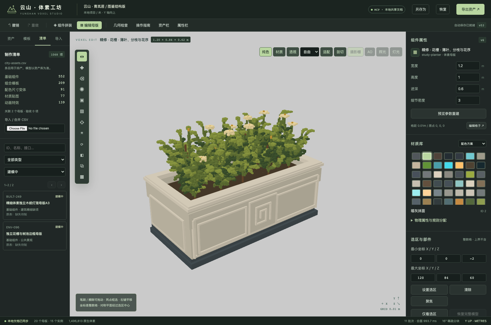
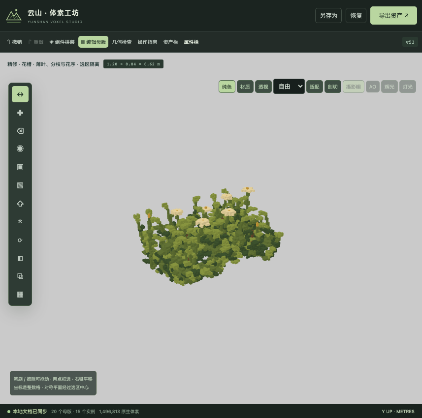

# 城市清单与细节制作工作流

本轮优先真实几何、编辑稳定性和制作管理，保留现有材质库。默认以纯色观察母版，纹理、光照和后期可后续通过独立材质 ID 统一调整。这里没有将清单条目转换为空盒模型，也没有把导入记录计入已制作资产。

## 输入清单与实际完成边界

来源是用户提供的 `city-assets.csv`，原文件未修改；项目内原样副本位于 `projects/catalog/city-assets.csv`。SHA-256：`4b594548f38cfcba4b620dc6f13f812ddd747c6df20025f4815cacd0302ebbfc`。共 1,068 条，ID 无重复。

| 条目类型 | 数量 | 当前处理方式 |
|---|---:|---|
| 基础组件 | 552 | 独立母版制作，关联实际原生资产后再检查 |
| 组合模板 | 209 | 复用母版和放置关系，不能重复计为新模型 |
| 配色尺寸变体 | 91 | 由母版参数、材质方案派生 |
| 材质贴图 | 77 | 保留制作要求，目前只覆盖现有材质属性及程序贴图 |
| 动画特效 | 139 | 记录需求，当前没有动画制作与验收功能 |

原表状态为“已集成代码生成”337 条、“隔离原型未集成”16 条、“缺失待制”692 条、“待核实”23 条。它们是来源记录。本次没有验证表中其他游戏项目的源码路径或据此宣布美术合格。表内说明、路径、接口名称均按数据保存，不作为工具指令或可执行代码。

主项目仍有 20 个历史母版、15 个实例、1 个旧民居组合。四个细节样板是既有 `study-bay / study-railing / study-planter / study-lantern` 的更新，见 [四构件实测](FOUR-COMPONENTS.md)。与清单明确相关的两项先作为候选关联：`BUILT-249 → study-lantern`、`ENV-096 → study-planter`，都标记“建模中”，记录尚缺游戏接口和验收。其他条目未自动关联；本地已验收为 0。

## 已实现的软件改动

- 「清单」侧栏：CSV 导入合并、全文搜索、类型/制作进度筛选、每页 24 项、来源详情、真实母版关联、制作备注。重复导入保留本地备注和未出现在新表中的旧行；重复 ID、缺列、损坏引号和超限输入明确拒绝。
- UI 与 MCP 共用 `importCatalog`、`catalogEntry` 事务；支持 dry-run、CAS 版本校验、幂等、失败回滚和整批撤销。首次添加可选字段时撤销残留的问题已修复。
- “已验收”需要非空母版与文字记录，记录当时母版版本。母版版本改变后显示“待验收”；仅修改备注不能清除这个状态。材质与动画不能以静态模型方式验收。删除母版前须先解除清单引用。
- 默认纯色视图；新增「仅看选区 / 恢复完整模型」，在后台生成显示用截面，不修改体素或保存数据。可配合部件区域、单层和聚焦检查薄叶、柱帽与内部空腔。区域标签仍是 AABB，不是假装独立运动零件。
- 打开单件仅构建该母版；拼装视图只构建有实例的母版，相同母版实例共享网格。每个缓存保留自身实际构建快照，隐藏期间的修改在再次打开时按脏块更新。
- 不活跃网格最多缓存 8 件，并在几何数组超过 128 MiB 时优先清理不活跃项。当前可见场景不强制截断，因此这不是整个应用的 128 MiB 内存上限。缓存释放同时销毁 GPU 几何资源。
- 基础色、粗糙度等修改复用几何；跨透明类别或发光岛可见性变化重建相关缓存。后台合面出错会显示错误，不将空缓存标记为完成。
- 窄面板适配，资产栏和属性栏可独立收起，避免标题与工具条重叠。

## 必须另外建设的能力

1. 门、抽屉、车轮等刚体动作：需要明确的独立体素部件、轴心、父子运动约束、关键帧和动画导出。目前没有这些工具。现有 90° 体素变换属于编辑命令，不是动画。
2. 人物/动物：清单中有 82 项角色动作与交互、22 项动物与照护动作，还包括程序姿态、天气/水体/载具特效。骨骼、蒙皮、IK、动作混合、接触约束及动画 GLB 尚未实现。
3. 游戏对接：清单多处要求 0.2m 权威物理结构、导航、支撑与功能点。现有 1–2cm 视觉体素不能直接当作已接入这些游戏契约；需要独立碰撞/接口适配与游戏内实测。
4. 大库：清单支持最多 5,000 条元数据，当前项目仍限定 500 个母版、单母版 100 万占据格。此轮按需网格减轻显示构建，但原生 JSON、历史和 WebSocket 仍传完整文档。分包索引、按资产加载原生块、增量持久化和多级 LOD 尚未实现。
5. 预算：细节版花槽合面仍有 60,968 三角形，适合近景检查，不能据此宣称可以在城市里无限密集放置。灯笼为 1,014 三角形，低于清单该项 1,800 的数值预算，但游戏接入与美术验收仍未完成。
6. 材质：可更换颜色/PBR参数/内置程序表面，独立材质 ID 已保留；任意外部材质资源包、手工 UV 与完整纹理创作管线尚未实现。二维界面条目也不能由体素母版替代。

## 实际验证

`npm test`：57/57 通过，日志 [core-tests.log](../artifacts/catalog/core-tests.log)。包括真实 CSV 全量无损读写、恶意/损坏 ID 与 CSV、来源状态不自动变验收、几何与清单的原子事务、撤销/重做、版本冲突、审核版本失效、区域隔离和隐藏缓存差异。

`npx tsx scripts/verify-catalog.ts`：独立项目目录和 4340 回环端口，10 组实际 Chromium/官方 stdio MCP 联测通过。[原始测量](../artifacts/catalog/verification.json) / [日志](../artifacts/catalog/integration.log)。缓存压力测试的十个单格对象仅是隔离测试夹具，从未安装到用户资产库。

| 实测场景 | 本次时间/结果 |
|---|---|
| 20 母版、1,496,813 原生体素项目，冷启动直接打开灯笼 | 1,841 ms，后台只构建 1 个母版 |
| 首次切换花槽 | 1,192 ms，其中后台合面 1,034 ms |
| 导入 1,068 行清单及记录修改 | 显示网格任务不增加 |
| 隐藏栏杆后通过 MCP 改格子，再打开 | 隐藏时不合面，打开时更新栏杆缓存 |
| 连续打开十个独立小测试件 | 保留 1 个可见 + 8 个不活跃缓存，旧大件被释放 |

上述为一次实际运行，未与旧版做同环境重复基准对比，因此不提供“提速倍数”。测试环境：Apple M3 Pro、18GiB、macOS 27.2 arm64、Node 24.19.0、Chromium 153.0.8010.12，ANGLE SwiftShader 软件 WebGL，不是 Apple GPU 帧率测试。

`npx tsx scripts/verify-detail-ui.ts` 验证真实按钮输入、857px 面板、侧栏收起、纯色切换和隔离恢复。[结果](../artifacts/catalog/detail-ui.json)。操作前后整个原生文档哈希相同。

主服务重启保留原有文档及撤销历史；官方 MCP 安装清单后执行一次撤销、重做并核对所有旧几何/材质/实例未变，版本 50 → 51 → 52 → 53。[安装记录](../artifacts/catalog/installed.json)。

## 打开与复现

- 编辑器：[花槽纯色检查](http://127.0.0.1:4317/?asset=study-planter&view=perspective&flat=1)，点击左侧「清单」。顶部可收起两侧面板。
- 原生项目：`projects/city-production.ysvox.json`。运行 `npm start` 后，可用「恢复」打开；自动保存含历史与清单。
- 清单输入：`projects/catalog/city-assets.csv`。原用户 CSV 保持不变。
- 接口：[MCP 配置](mcp.local.json)、[14 个工具 Schema](tool-schemas.json)、[命令说明](MCP.md)。
- 四件原生项目与 GLB/碰撞/接口导出仍在 [四构件交付说明](FOUR-COMPONENTS.md) 中列出。

