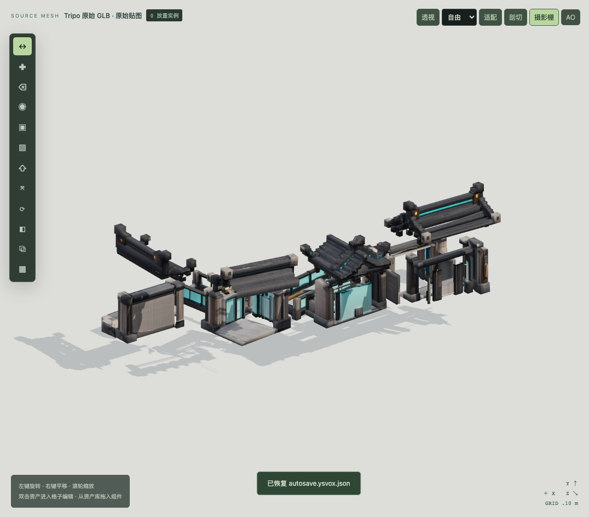
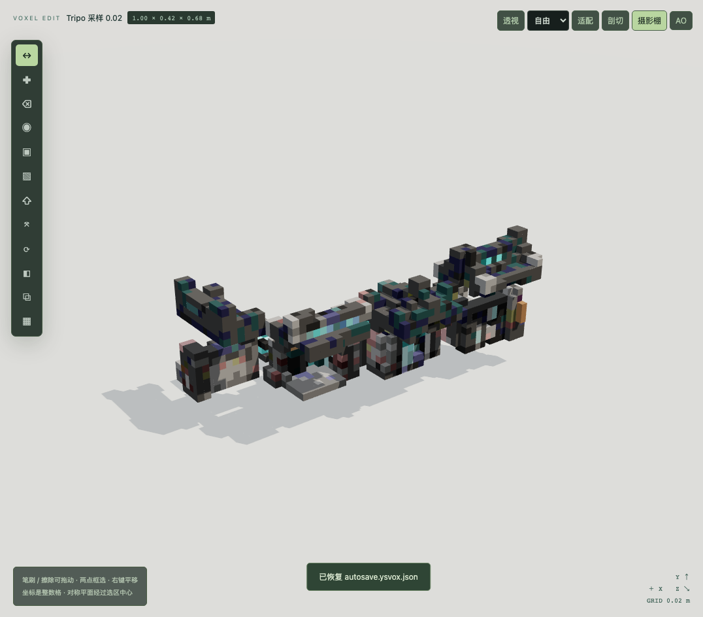
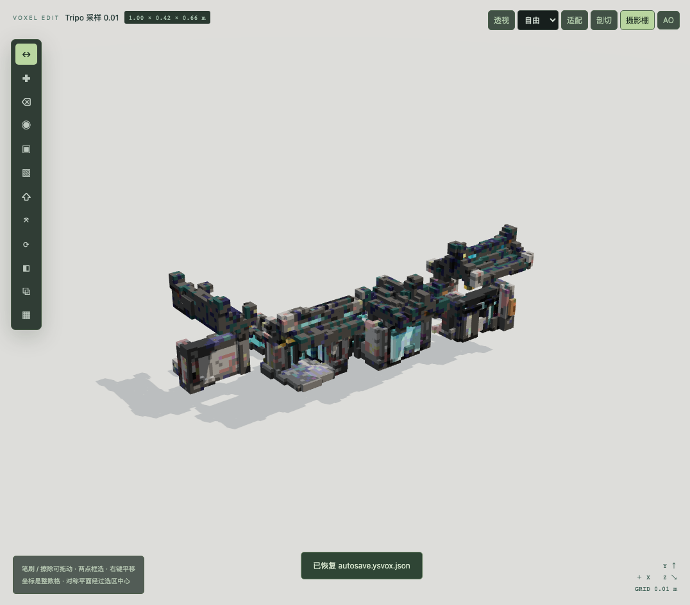
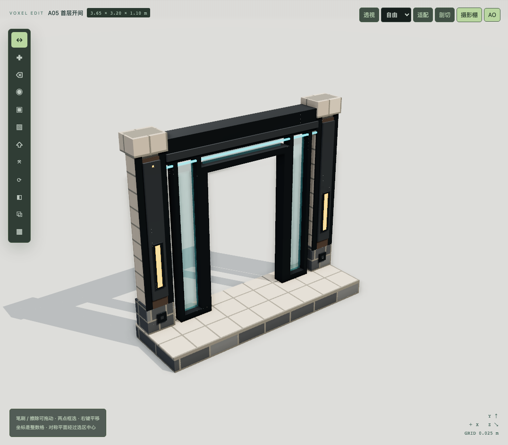
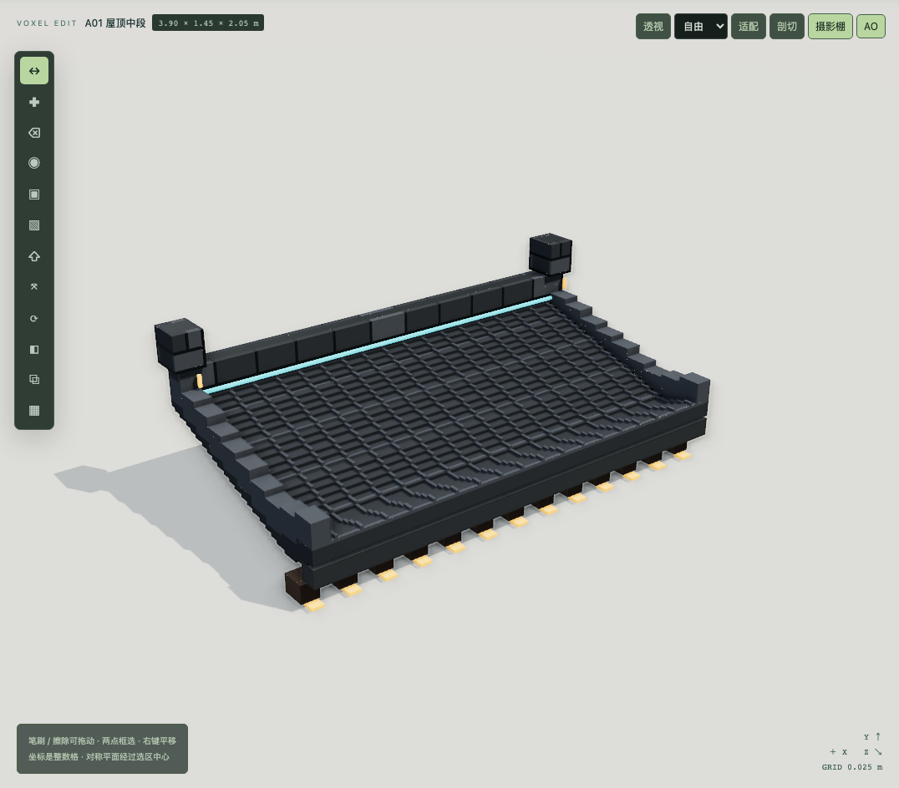
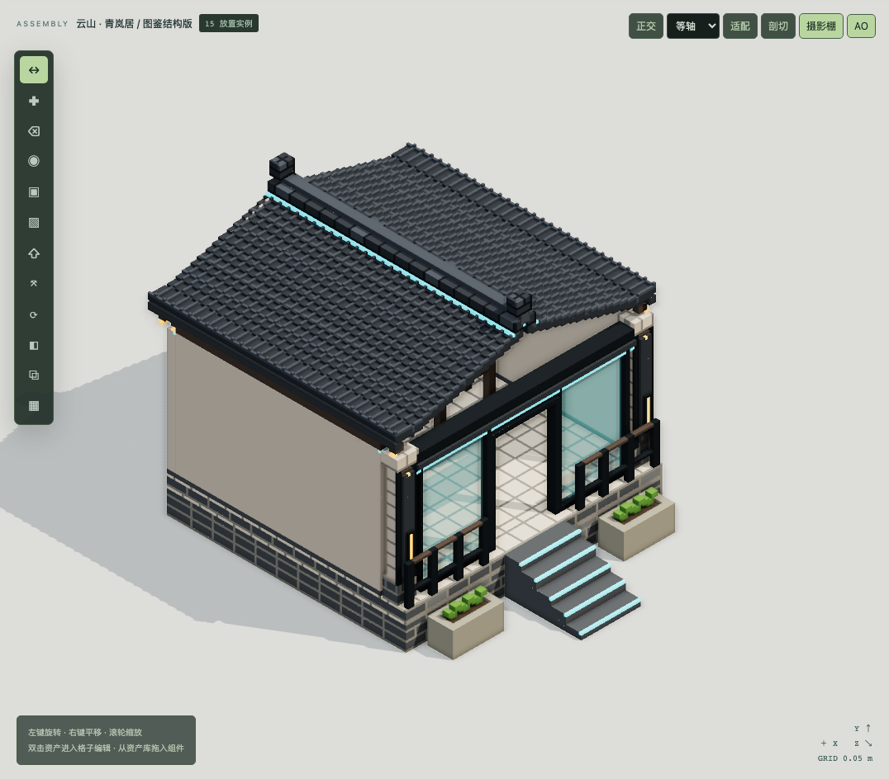
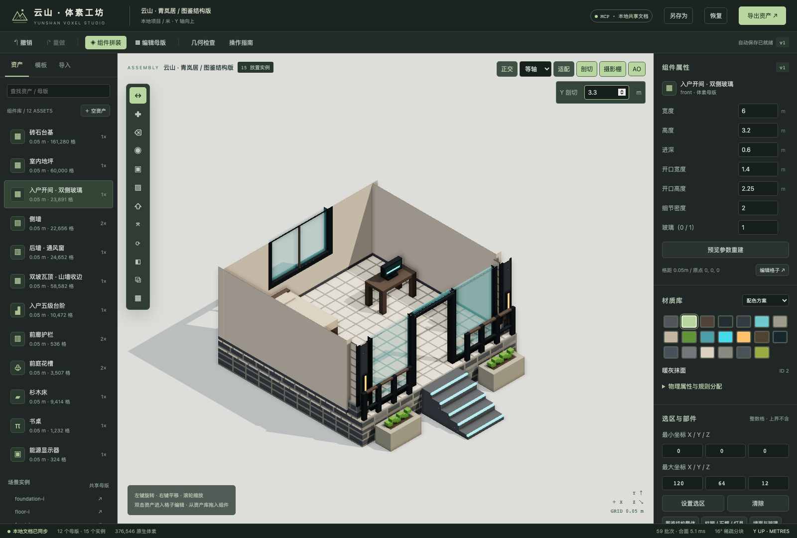

# 参考图与 Tripo 实测：转换，还是按图重建？

实际使用用户提供的《庭院建筑模块图鉴-2.png》与 modular building 3d model.glb。原件副本位于 projects/reference-study，未覆盖用户原文件。GLB SHA-256：`6869566f65ab4568665fdc6ab9b788d3e0e1b3ff82570efe8ba35af45ab2dbea`。

参考实验完成于 2026/10/2 17:46:20；新民居验证完成于 2026/10/2 17:55:53。参考实验 6 项、民居 4 项均通过。它们使用真实 stdio MCP、后台转换线程、实际浏览器和实际文件；没有生成式效果图或预录画面。

## 实际结论

对于这份模型，**最快得到近似外形的是模型表面体素化；要得到能改开口、复用并拼装的建筑模块，按图编写参数化体素模板更合适**。后者的优势是结构与材质角色可控，修改参数后能够重复生成。读图分析、编写模板、检查背面和修复的时间没有独立计量，不能拿下面的程序运行毫秒断言从零制作的总成本更低。

原版问题同时包括造型和显示：过厚的屋面、重复的大块轮廓、缺少收边与柱梁层次，以及平淡的光照。新版加入了真实体素分缝、瓦垄、柱脚/石帽、门窗框、实际透明面、灯匣和可关闭的摄影棚阴影/环境反射/SSAO。**目前仍未达到参考图的美术完成度**：飞檐轮廓、构件细部和材质层次是有限近似；没有圆滑倒角或自动恢复图中不可见的结构。

## 原模型到底保留了什么

源 GLB 有一个 mesh、一个 primitive、一个基础材质和一张 JPEG 基础色贴图，含 8,089 个三角形。图中的蓝色玻璃与灯光主要存在于颜色贴图里，没有独立玻璃混合材质与发光材质。不能从这些颜色宣称已恢复真实玻璃、金属、木材或灯具。

整体尺寸约 0.9995 × 0.4146 × 0.6567 米。它表现为一个归一化的组件图鉴集合，未提供可信的单个开间实际尺寸。本次转换保持 scale=1；2cm / 1cm 是相对此约一米宽整体的格距，不可与一个 3.6m 宽重建开间的 2.5cm 直接当作同尺度质量评分。

几何诊断（位置按 10⁻⁶m 焊接统计）：2653 条开放边、77 条非流形边、1 个退化三角形、307 个网格连通片；602 对连通片包围盒可能重叠。307 个连通片并不等于 307 个资产；AABB 重叠也不是已经证明三角形自交。正/背/顶视图显示部分背面、接缝和组件分离信息需要重建。

[正面](../artifacts/reference-study/tripo-front.png) · [背面](../artifacts/reference-study/tripo-back.png) · [顶面](../artifacts/reference-study/tripo-top.png) · [真实 UI 上传与贴图预览](../artifacts/reference-study/ui-source-texture-inspection.png)

## 路线 A：模型转换与有限修复

两档均采用表面相交、保守薄片、原点 [0,0,0]、Y 向上、scale=1、RGB 每通道 8 级。测量运行在 Apple M3 Pro / 18GiB / Node v24.19.0 的同一环境。

| 格距 | 占用体素 | 采样材质数 | 体素连通片 | 转换核心 | MCP 开始任务至完成 |
| --- | ---: | ---: | ---: | ---: | ---: |
| 0.02m | 2,839 | 103 | 10 | 211.24ms | 783.04ms |
| 0.01m | 12,957 | 110 | 12 | 325.16ms | 893.87ms |

核心时间含诊断、相交、采样及结果整理，不含原件加载；MCP 时间还含加载、线程启动和状态轮询。单次测量有 JIT/调度影响，不是平均吞吐量。源加载另测得 91.77ms。

细档保留更多轮廓，但体素连通片数量恰好是 12 并不意味着已经识别出 12 个正确建筑组件。两个结果依旧需要语义拆件、确定实际尺度、重建安装点、确认薄壁与门窗。这里没有把一键转换称为修复完成。

尝试了可审查的材质修复规则：采样 G,B>95 且 R<0.55G；仅局部 Y≥0.26m；人工假设为上部灯带，仍需逐片检查。 实际修改 16 格，仅标注为人工假设的屋面灯带。低处的青色仍可能是玻璃、反射或涂料，没有自动全部改成玻璃。该事务可撤销，完整候选色和数量在 study.json 中。

保留的失败：

- [实体填充失败](../artifacts/reference-study/tripo-solid-failure.json)：非封闭/非流形网格被拒绝，没有默认封死开口。
- [16 级颜色采样失败](../artifacts/reference-study/tripo-0.01-palette16-failure.json)：超过 512 色预算。界面现可显式选择 4/8/16 级，降低级数会损失颜色精度。
- [早期大响应连接失败](../artifacts/reference-study/study-fine-transport-failure.json)：完整高精度项目超过 stdio 客户端缓冲区。已改成 8MiB 单响应保护，返回 RESULT_TOO_LARGE 并保持连接，区域体素分页查询实测通过。

自动完成的只有变换、颜色采样、重复占用归并、诊断和表面采样。粘连前的语义边界、未知背面、正确建筑承重结构和低于格距的孔隙仍须人工决定。复杂透射效果不转换为假玻璃；Alpha 混合/裁切或透射面会阻止实体填充，包含透明度仅在贴图中的情况。

## 路线 B：AI 读图、编写模板，再通过 MCP 生成

本次由 AI 解析参考图并编写规则，新增 A01–A12 共 12 个生成器，源码 src/core/reference-templates.ts。它们写入真实稀疏体素和材质 ID，不拉伸显示网格。宽/高/进深、适用的开口、玻璃、瓦片厚度和细节控制会重新生成；不适用的参数会被拒绝。图鉴转角模板目前要求等宽等深，不等臂通过直段拼装。

本例统一 20 个显式材质，2.5cm 格距，12 个独立母版、12 个展示实例，共 2,014,966 个母版体素。开间名义宽 3.6m；转角样例 3m × 3m；原点、包围盒、根部件和四个基础接口随项目保存。局部帽石可能超过名义尺寸，实际包围盒以格子计算值为准。显示实例没有被算成新资产。

通过真实 MCP 一批生成：dry-run 7,385.89ms，提交 7,651.45ms（含校验、差异、文件保存）。这些是已经写好生成器之后的运行时间，**不是图片自动复刻时间**。

[十二组件陈列](../artifacts/reference-study/reference-library.png) · [门楼](../artifacts/reference-study/ref-gateway-render.png) · [山墙](../artifacts/reference-study/ref-gable-render.png) · [上层开间](../artifacts/reference-study/ref-balcony-render.png) · [连桥](../artifacts/reference-study/ref-bridge-render.png)

厚度和隐藏面是显式设计假设，不能从单张参考图唯一确定。原生数据保留每一格，可继续擦除/填充/赋材质；但重新生成模板会替换手工修改，预览会提示影响实例。胶合结构、自动识别门窗、自动分成语义组件、通用单图重建尚未实现。

单开间浏览器采样：11 个主模型材质批次，renderer.info 共 23 次渲染调用；120 个 rAF 间隔中位数 59.2ms。使用 Playwright 无头 Chromium（与主验证相同启动方式，主验证驱动为 SwiftShader 软件渲染），采样时 AO 关闭。这不是 Apple GPU 的帧率承诺；SSAO 会增加渲染成本，默认关闭。

额外截图巡检中，一次无头 Chromium 在连续截图后关闭了页面，日志含 GPU 状态错误；根因尚未确定，不能据此宣称渲染稳定性已完全验证。随后重新启动浏览器，以相同 AO 设置完成了正交观察、3.3m 剖切、顶视图切换和最终截图，没有捕获到页面脚本异常，文档仍为版本 1。[事件记录](../artifacts/reference-study/capture-driver-note.json) · [复查记录](../artifacts/reference-study/final-ui-check.json) · [最终实际界面](../artifacts/reference-study/final-editor.png)。

## 新民居：验证能否真正装起来

另建 projects/courtyard-house.ysvox.json：12 个母版、15 个实例、1 个组合模板，5cm 网格，376,546 格。使用图鉴开间、双坡瓦顶、砖石台基，再组合墙窗、台阶、栏杆、花槽、床、桌和显示器。屋顶有实际体素承托条。

[俯视室内](../artifacts/reference-study/courtyard-house-interior-top.png) · [完整编辑器](../artifacts/reference-study/courtyard-house-editor.png) · [MCP 批量修改](../artifacts/reference-study/courtyard-house-mcp-batch.png)

占用格检查结果：0 对碰撞、0 个无下方支撑实例。入口宽 1.4m、高 2.25m，指定 2.15m 门口净空与首阶/顶阶上方 2m 净空全部通过；外部组件没有堵住声明的门窗。支撑只是垂直接触检查，不是结构受力分析。

对新民居也实际执行了一批 MCP 操作：后窗从 2.2m 加宽至 2.8m、替换墙材质、复制花槽、调整共享灯带。浏览器同步了相同版本，一次 undo 恢复体素、材质和实例。GLB 重新导入的坐标验证通过，原生体素、碰撞、接口分别输出。

## 交付位置与复现

- projects/courtyard-reference.ysvox.json：高精度组件库。
- projects/courtyard-house.ysvox.json：新民居与家具。
- projects/reference-study/tripo-converted.ysvox.json：真实转换与规则修复实验。
- projects/reference-study/exports/：所有路线的 visual.glb、voxels.ysvox.json、collision.json、interfaces.json、材质图集。
- [原始实验记录](../artifacts/reference-study/study.json)、[民居验证记录](../artifacts/reference-study/house-verification.json)、[完整回归与环境](VALIDATION.md)、[功能与限制](CAPABILITIES.md)。

复现：先 npm run build，再 npm run verify:reference；核心与回归为 npm test、npm run verify。生成报告用 npm run report。测试使用独立目录及 4337/4338 端口，不修改正在编辑的项目。
